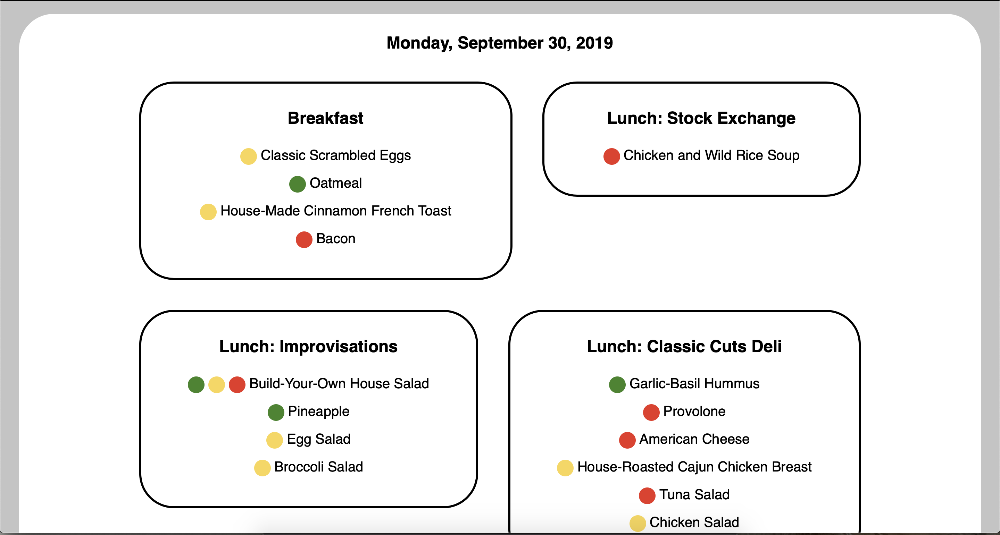

# Sage Dining Menu Client
A nifty website/api for Sage Dining menus

## About
This project allows one to host a menu site/api for a Sage Dining menu of their choice

 It presents data to users with an alternate (or better, depending on your tastes) web view. [See the website section for more info.](#website)

 It also has an exciting API (which Sage Dining has, but it's complicated and undocumented) that returns data in a lovely JSON format. [See the API section for more info.](#api-endpoints)

 Speaking of Sage's undocumented API, I also reverse engineered the documentation for several Sage API endpoints, so if you'd like to develop something with the official Sage API, [check out the Sage API Documentation](SAGE_API.md)

 ## Installation

 Installation is quite simple. But, to scrape data, you'll need to start by getting a Sage Dining account. 
 
 Just download their mobile app (no web account creation ☹️), make an account (you can use a disposable email service), and insert the credentials below.
 
 Then, clone the repo and install the requirements.

 This project works with Python 3.7 (maybe 3.6?) and manages dependencies with pipenv, so to install dependencies, just use `pipenv install`.

 Next, create a `config.json` file in the root of the project directory that looks like the one below.

 ```json
{
    "sage": {
        "email": "example@example.com",
        "password": "thisisatest",
        "unit_id": 1370,
        "menu_id": 90945,
        "menu_titles": ["Breakfast", "Lunch"]
    },
    "scrape_key": "ofjodsjfijsdifjisdfijdsjffjidj",
    "db_path": "$HERE/menu.sqlite3",
    "timezone": "America/Chicago",
    "shortcut_url": "https://www.icloud.com/shortcuts/33b878254f1042e0808dcd4d114b759b"
}
 ```

A config needs to have several components

* A Sage Section w/ attributes specific to Sage scraping
* sage: email: An email address associated with a Sage Acccount (see above)
* sage: password: The password for the Sage account
* sage: unit_id: The Sage Unit Id for your school. Can be found with the `/findschool` endpoint from the [API Docs](SAGE_API.md#findschool)
* sage: menu_id: The Sage Menu Id for the menu you want to grab. Can be found with the `/getmenus` endpoint frm the [API Docs](SAGE_API.md#getmenus)
* sage: menu_titles: So I have no way of knowing what the meals should be called, so go to the online sage menu, figure out what the meals are called, and put them in a list, so the web view can use it.

* scrape_key: Some long and complicated string that you will have to use for authentication when requesting a scrape. See below for scraping info or the [`/scrape` endpoint](#scrape-post) for even more info
* db_path: A path to an sqlite3 db, which should create a new one if none exists. Use $HERE as a shortcut for the directory where the config resides.
* timezone: A valid [tz database timezone name](https://en.wikipedia.org/wiki/List_of_tz_database_time_zones)
* shortcut_url (optional): If you have a Siri Shortcut for clients to use to hit the api, you can put the URL here
* sentry_dsn (optional): If you want to use Sentry for error tracking, put the DSN in with `sentry_dsn` as the key.

You're almost there! Then, all you have to do is run Flask
```
export FLASK_APP=menu.app
flask run   
```

To scrape the menu, hit the [`/scrape` endpoint](#scrape) with a POST request, with a form body with `scrape_key` as a key, and the scrape key defined in `config.json` as the key

## Website


It currently shows the current week. There is currently no way to see future weeks, but that is in progress

## API Endpoints

#### `/fetch` (GET)
Returns menu data for a specified date (or dates)
##### Query Args
* `date`: A date formatted in YYYY-MM-DD to get menu_data for. Default is the first applicable date
* `days`: The number of days to get data for. If `date` is provided, then it acts as the start date

#### `/scrape` (POST)
Scrapes Sage Menu Data using data in `config.json`

##### Post Args
* `scrape_key`: The scrape key found in `config.json`